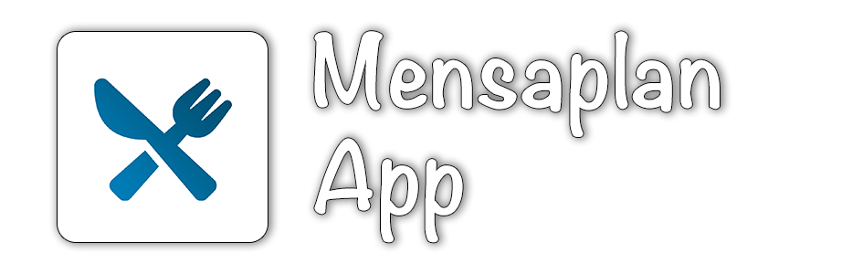

  

# Mensaplan App
This app allows you to see the current menu of the canteen of the University Trier and Hochschule Trier.

# System Requirements
- iPhone/iPad: iOS 11 or newer
- Mac: macOS 10.15 Catalina or newer

# Contributing
I'm happy if you want to contribute. Please open an issue if you want to:
- report a bug / feedback
- request a feature

Please open a pull request if you want to:
- fix a bug
- add a feature

# License
GNU General Public License - see LICENSE.txt  
© 2019 Marc Hein - [marc-hein.de ](https://marc-hein.de) 

This program is free software; you can redistribute it and/or modify it under the terms of the GNU General Public License as published by the Free Software Foundation; either version 2 of the License, or (at your option) any later version.

This program is distributed in the hope that it will be useful, but WITHOUT ANY WARRANTY; without even the implied warranty of MERCHANTABILITY or FITNESS FOR A PARTICULAR PURPOSE. See the GNU General Public License for more details.

You should have received a copy of the GNU General Public License along with this program; if not, write to: Free Software Foundation, Inc. 59 Temple Place - Suite 330 Boston, MA 02111-1307, USA.
